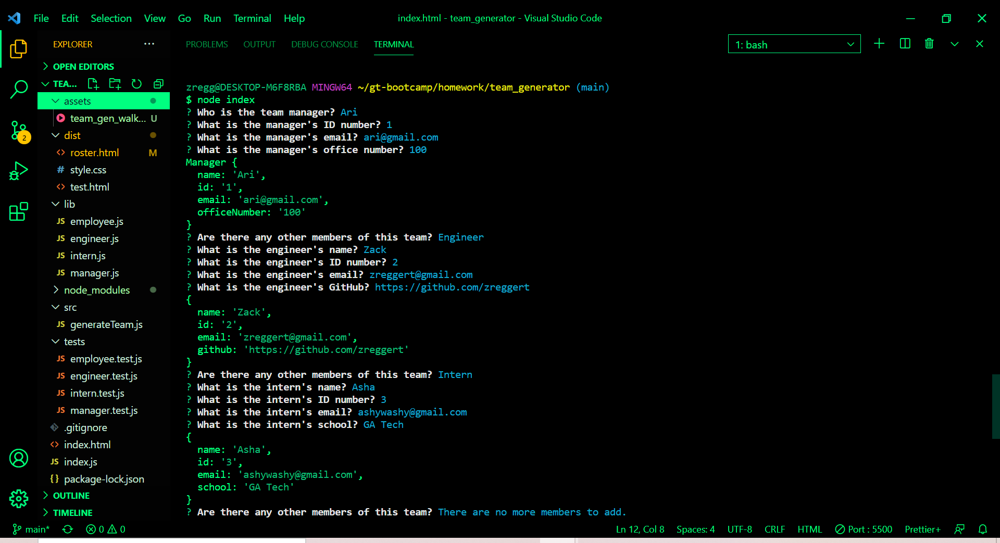
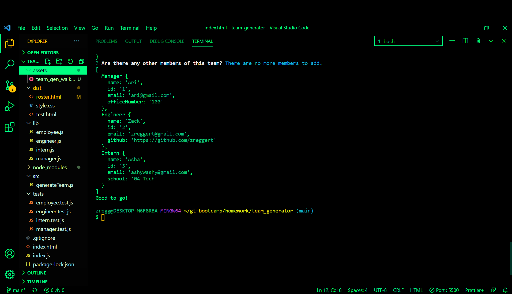
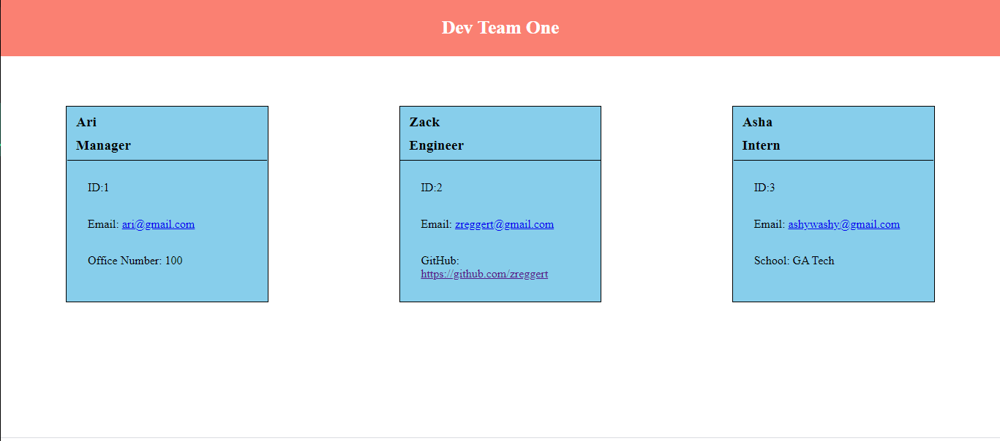

# Team Profile Generator
  
  

  ## Descrription
  This application allows clients to create a html file for their team's roster and display information for each team member such as name, id number, and email. Also based on their role on the team, the client can input specific information for that employee. 

  ## Table of Contents
  -[Description](#description)

  -[Installation](#installation)

  -[Usage](#usage)

  -[License](#license)

  -[Contributions](#contributions)

  -[Tests](#tests)

  -[Questions](#questions)

  ## Installation
  npm install inquirer

  ## Usage
  In terminal, run node index.js to initiate application.

  ## License
  Copyright (C) 2021 Zachary Eggert

  This project is licensed under the MIT license.

  https://opensource.org/licenses/MIT

  ## Contributions
  This was a individual project from Zachary Eggert

  ## Tests
  jest

  ## Questions
  For any questions you can reach me at:
  zreggert@gmail.com

  Also please check out this application's repo and my other work at:
  https://github.com/zreggert
  
## Links

Video Walkthrough: https://zreggert.github.io/team_generator/

## Snapshots

Prompted Questions:

Generated instances:

HTML Generated from results:

